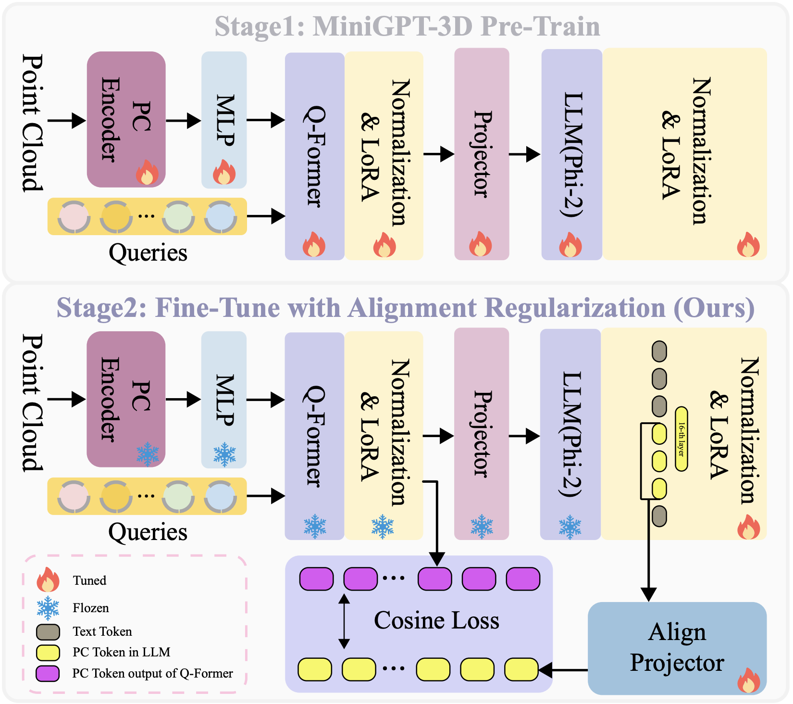

# PointAlign (CVPR 2026)
### [Paper](https://arxiv.org/abs/2603.00412) | [Code](https://github.com/yharoldsu0627/PointAlign)
> PointAlign: Feature-Level Alignment Regularization for 3D Vision-Language Models\
> Yuanhao Su, Shaofeng Zhang, Xiaosong Jia, Qi Fan\
> CVPR 2026

✨ **A step towards better 3D vision-language understanding by preserving geometric information throughout the language modeling process.**

### ✅ Project Status

🎉 **Accepted to CVPR 2026!**

- [x] Release introduction & results
- [x] Release training & inference code
- [x] Upload pretrained weights

If you find PointAlign useful, please consider giving us a star ⭐.

### Introduction

🔍
**Geometric Information Degradation:** Existing 3D VLMs rely solely on next-token prediction loss, causing valuable geometric cues to be discarded during training. PointAlign addresses this by explicitly supervising intermediate point cloud tokens within the LLM to preserve fine-grained 3D geometric-semantic information throughout the language modeling process.

### Overview

<div align="center">
  
</div>

<p align="center">Figure 1. Overview of PointAlign.</p>

PointAlign enhances 3D vision-language understanding through **feature-level alignment regularization** — a cosine similarity loss that aligns intermediate point cloud tokens in the LLM with Q-Former outputs. The alignment projector is used **only during training** and discarded at inference, introducing **zero additional inference overhead**.

### Quantitative Results

**3D Object Classification**

| Model | ModelNet40 (I) | ModelNet40 (C) | ModelNet40 Avg | Objaverse (I) | Objaverse (C) | Objaverse Avg | Overall Avg |
|-------|:-:|:-:|:-:|:-:|:-:|:-:|:-:|
| PointLLM-7B | 51.34 | 50.36 | 50.85 | 62.00 | 63.00 | 62.50 | 56.68 |
| PointLLM-13B | 51.70 | 52.67 | 52.19 | 61.50 | 63.00 | 62.25 | 57.22 |
| MiniGPT-3D | **61.99** | 60.49 | **61.24** | 65.00 | 68.50 | 66.75 | 64.00 |
| **PointAlign (Ours)** | 61.55 | **60.78** | 61.17 | **72.50** | **69.50** | **71.00** | **66.08** |

**3D Object Captioning on Objaverse**

<div align="center">

| Model | Qwen2-72B ↑ | Sentence-BERT ↑ | SimCSE ↑ | Avg ↑ |
|-------|:-:|:-:|:-:|:-:|
| PointLLM-7B | 42.20 | 48.50 | 48.92 | 46.54 |
| PointLLM-13B | 40.40 | 49.07 | 48.41 | 45.96 |
| MiniGPT-3D | 48.17 | **49.54** | **51.39** | 49.70 |
| **PointAlign (Ours)** | **53.05** | 49.94 | 51.32 | **51.44** |

</div>

## ⚙️ Quick Start

### Installation and Data Preparation

```bash
git clone https://github.com/yharoldsu0627/PointAlign.git
cd PointAlign
```

For detailed setup instructions, please refer to [MiniGPT-3D](https://github.com/TangYuan96/MiniGPT-3D).

### Pretrained Weights

Download the pretrained weights from [Baidu Pan](https://pan.baidu.com/s/1QQ65gGhagQmrVjt96GDY3A?pwd=x7n5) (extraction code: `x7n5`) and place them under `./params_weight/` before training:

```
./params_weight/
└── <weight_file>
```

### Training

```bash
CUDA_VISIBLE_DEVICES=0 python train.py --cfg-path finetune.yaml
```

### Evaluation

Please follow the evaluation instructions from [MiniGPT-3D](https://github.com/TangYuan96/MiniGPT-3D).

## Acknowledgement

This project builds upon [**MiniGPT-3D**](https://github.com/TangYuan96/MiniGPT-3D). We thank the authors for their excellent codebase.

## Citation

```bibtex
@article{su2026pointalign,
  title={PointAlign: Feature-Level Alignment Regularization for 3D Vision-Language Models},
  author={Su, Yuanhao and Zhang, Shaofeng and Jia, Xiaosong and Fan, Qi},
  journal={arXiv preprint arXiv:2603.00412},
  year={2026}
}
```
